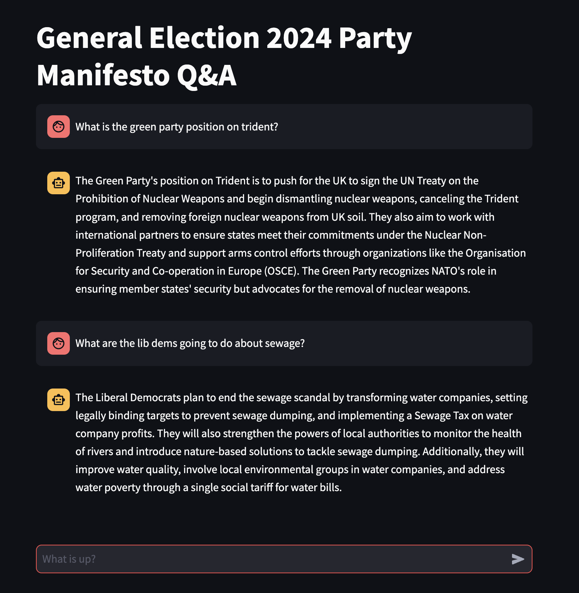

# UK General Election Manifesto Q&A with RAG

Code for building a chatbot that answers questions about UK political party policies as
written in their manifestos for the 2024 general election, using Retrieval Augmented
Generation (RAG).




Technologies include:
- Streamlit for creating the chat interface
- Weaviate as the vector database for storage and retrieval of manifesto content
- OpenAI's GPT (for generating answers) and ada models (for creating vector embeddings)
- LangChain for chaining together document loading/chunking, context retrival and generation


## Next steps
- Tidy up `app.py` with functions (inc. `run()`) and if/else to choose between question format  
    based on the rag chain
- Enable data persistency for the vector db 
- Explore how the bot's performance changes with different ML models (consider HF models)
- Tidy up notebooks and other code
- Write up documentation

Other improvements to consider:
- Different vector search methods (e.g. hybrid, keyword, BM25)
- Different document loading/chunking approaches
- Use compression to reduce the size of the context being passed (save costs)
- Make the system flexible for switching out models (vector embeddings, generation)
- Considerations for cloud deployment of the chatbot


## Setup

### Configure your environment

Currently the Weaviate instance is configured to use OpenAI APIs for creating vector embeddings
from text, and to use GPT to generate model responses. 

Define the following environment variables in an `.env` file at the root of the repo:

```
OPENAI_API_KEY=""

WEAVIATE_URL="http://localhost:8080"
WEAVIATE_API_KEY=""
WEAVIATE_STORAGE=""
```

### Spin up the VectorDB

Docker is used to run a containerised instance of Weaviate. Use the following command to spin this up:

```bash
docker compose up -d
```

### Install the application dependencies

This project uses poetry for managing python dependencies. Install poetry and then run the folllowing: 

```bash
poetry install
```

### Run the chatbot app

Streamlit is used to run the chatbot application. Run the following command at the terminal:

```bash
streamlit run manifesto_qa/app.py
```

Navigate to `localhost:8501` in a browser to interact with the chatbot. 